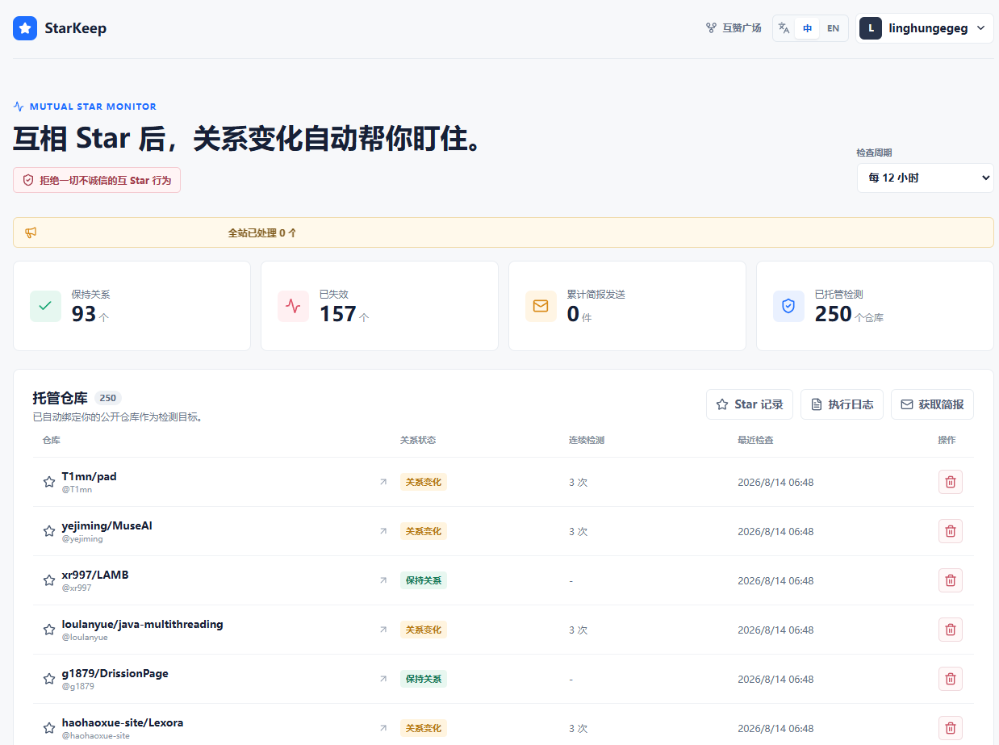
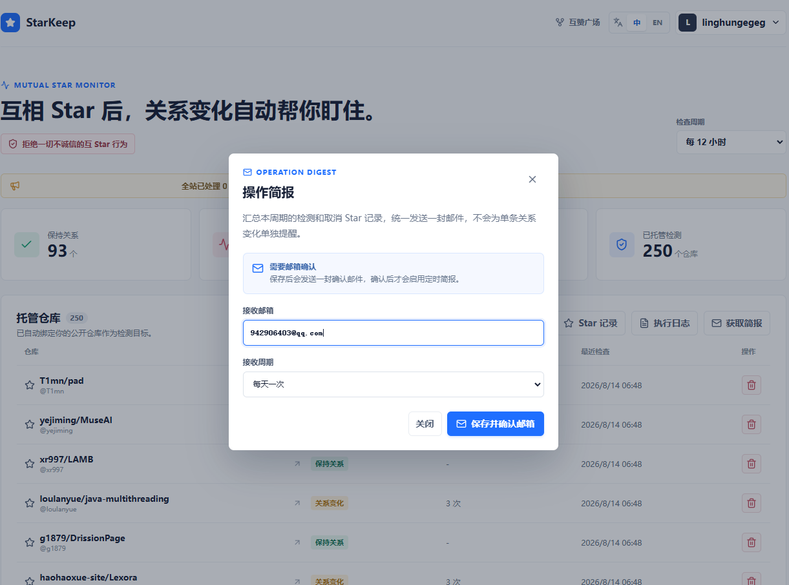
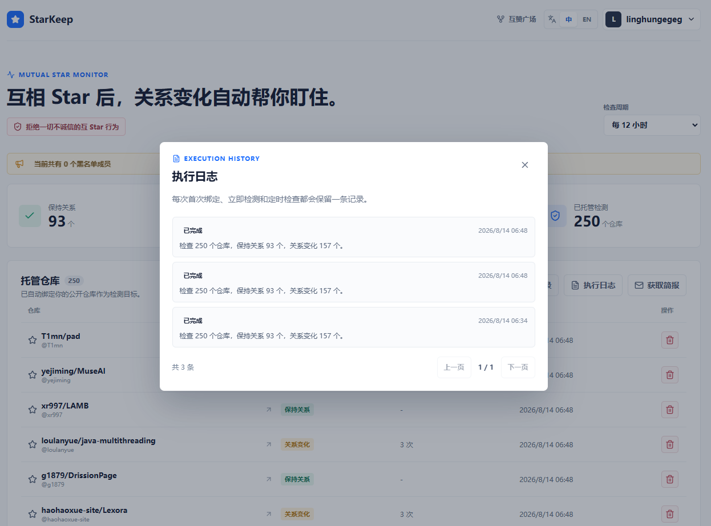
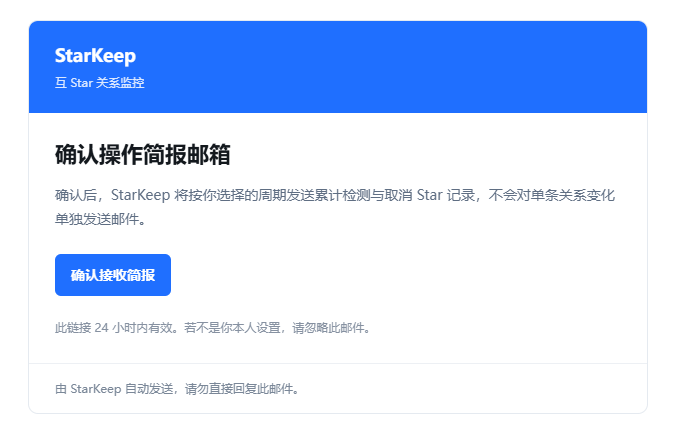
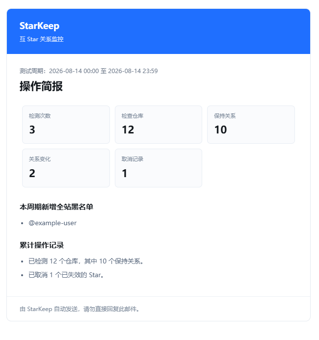

<div align="center">

# StarKeep

**GitHub Mutual Star Gallery and Star Monitor**

[](README.md)
[](LICENSE)
[](https://star.2fakey.icu/)


</div>

StarKeep is a GitHub Star relationship management tool based on Fine-grained Tokens. Users can manage multiple public repositories for mutual Stars, choose a default return repository, and continuously monitor established mutual Star relationships.

## Highlights

- **Mutual Star gallery**: Publicly lists managed repositories for visitors to browse and start a mutual Star flow after connecting a Token.
- **Automatic return Star**: Each user can manage multiple repositories and select one as the default return repository.
- **Clear relationship states**: Distinguishes between `Mutual`, `Not mutual yet`, and `Relationship changed`.
- **Automatic removal for broken mutual Stars**: Removes your Star only when a repository was mutual before and the other side later removed their Star. Historical Stars that never became mutual are never removed automatically.
- **Execution history and pagination**: Managed repositories, gallery entries, mutual Star records, Star records, blacklist entries, and execution logs are paginated.
- **Persistent shared Token**: Tokens are encrypted at rest and shared by the monitor and mutual Star gallery for the same user. Browser cache is not required.
- **Email digests**: Bind an email address for periodic summaries of checks, relationship changes, and Star removals.

## Screenshots

<table>
  <tr>
    <td align="center" width="50%"></td>
    <td align="center" width="50%"></td>
  </tr>
  <tr>
    <td align="center"><sub>Monitoring dashboard</sub></td>
    <td align="center"><sub>Mutual Star gallery and managed repositories</sub></td>
  </tr>
  <tr>
    <td align="center"></td>
    <td align="center"></td>
  </tr>
  <tr>
    <td align="center"><sub>Mutual Star records and states</sub></td>
    <td align="center"><sub>Token connection</sub></td>
  </tr>
  <tr>
    <td colspan="2" align="center"></td>
  </tr>
  <tr>
    <td colspan="2" align="center"><sub>Email digest settings</sub></td>
  </tr>
</table>

## Technology

- **Web**: Next.js 16, React 19, TypeScript, Lucide Icons
- **Server**: Next.js Route Handlers, Node.js, BullMQ Worker
- **Storage and queue**: PostgreSQL 17, Redis 7
- **External services**: GitHub REST API, Resend SMTP/API
- **Deployment**: Docker and Docker Compose

## Project Layout

```text
.
├── app/                         # Next.js pages, styles, and API routes
│   ├── api/                     # Token, monitoring, mutual Star, and digest APIs
│   ├── globals.css              # Global styles
│   └── page.tsx                 # Main screen and mutual Star gallery
├── db/migrations/               # PostgreSQL incremental migrations
├── lib/                         # GitHub, encryption, monitor, queue, and email logic
├── scripts/migrate.ts           # Database migration entry point
├── img/                         # README screenshots, contact, and donation QR codes
├── worker.ts                    # Scheduled checks, return Stars, and email digest worker
├── Dockerfile                   # Production image definition
├── docker-compose.prod.yml      # Production Compose stack
└── .env.example                 # Environment variable example
```

## Deployment

### 1. Prerequisites

- Docker and Docker Compose
- A GitHub Fine-grained Token with `Starring: Read and write`
- A publicly accessible site domain
- PostgreSQL and Redis are started by Compose
- For email digests, a Resend API key and verified sender address

### 2. Configure environment variables

```bash
cp .env.example .env
```

Edit `.env` and set at least the following values:

```dotenv
POSTGRES_PASSWORD=replace-with-a-strong-password
TOKEN_ENCRYPTION_KEY=replace-with-a-32-byte-secret
SESSION_SECRET=replace-with-a-32-byte-secret
PUBLIC_ORIGIN=https://star.example.com

# Optional: email digests
RESEND_API_KEY=re_xxx
RESEND_FROM_EMAIL=starkeep@example.com
RESEND_FROM_NAME=StarKeep
```

Generate secrets with:

```bash
openssl rand -base64 32
```

### 3. Build and start

```bash
docker build -t starkeep:latest .
STARKEEP_IMAGE=starkeep:latest docker compose -f docker-compose.prod.yml up -d db redis
```

Run database migrations, then start the application and worker:

```bash
STARKEEP_IMAGE=starkeep:latest docker compose -f docker-compose.prod.yml run --rm --no-deps app npm run db:migrate
STARKEEP_IMAGE=starkeep:latest docker compose -f docker-compose.prod.yml up -d --no-build app worker
```

The service listens on `127.0.0.1:3210` by default. Use Nginx, Caddy, or another reverse proxy for HTTPS and set the public domain in `PUBLIC_ORIGIN`.

### 4. Update an existing deployment

Build on an independent build host, then export, transfer, and load the image on production. Avoid building images on the production host:

```bash
# Build host
docker build -t starkeep:release .
docker save -o starkeep-release.tar starkeep:release

# Production host
docker load -i starkeep-release.tar
STARKEEP_IMAGE=starkeep:release docker compose -f docker-compose.prod.yml up -d db redis
STARKEEP_IMAGE=starkeep:release docker compose -f docker-compose.prod.yml run --rm --no-deps app npm run db:migrate
STARKEEP_IMAGE=starkeep:release docker compose -f docker-compose.prod.yml up -d --no-build app worker
```

## Usage

1. Enter a GitHub Token. StarKeep syncs repositories you have starred and your public repositories.
2. Open the Mutual Star gallery, choose one or more repositories to manage, and select a default return repository.
3. Save the managed repositories. They appear in the gallery. When a visitor Stars one of your repositories, StarKeep uses your Token to automatically Star the visitor's default repository.
4. The first connection runs an immediate check. Subsequent checks follow the configured interval.
5. If a previously mutual repository removes its Star, StarKeep records the relationship change, adds the owner to the blacklist, and removes your Star. Repositories that never became mutual only show their state and are not removed automatically.

## Contact and Support

<table>
  <tr>
    <td align="center" width="50%">
      <strong>WeChat</strong><br /><br />
      
    </td>
    <td align="center" width="50%">
      <strong>Support the project</strong><br /><br />
      
    </td>
  </tr>
</table>
